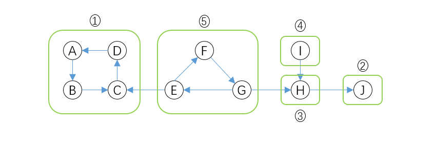
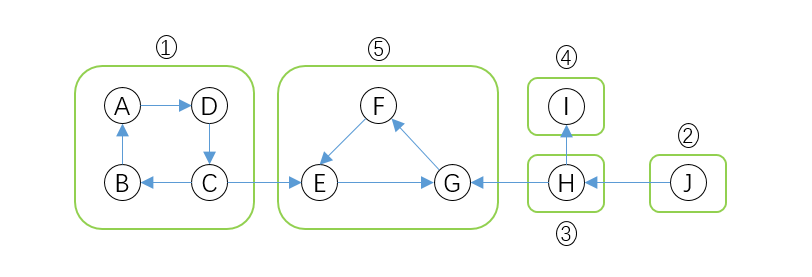

# Graph

## Graph and its representations

A graph is a data structure that consists of the following two components:

> A finite set of vertices also called as nodes.
>
> A finite set of ordered pair of the form (u, v) called as edge. The pair of the form (u, v) indicates that there is an edge from vertex u to vertex v. The edges may contain weight/value/cost.

有向图 directed graph(di-graph)

无向图

**邻接矩阵 Adjacency Matrix**

Adjacency Matrix is a 2D array of size V x V where V is the number of vertices in a graph. Let the 2D array be adj[][], a slot adj[i][j] = 1 indicates that there is an edge from vertex i to vertex j. Adjacency matrix for undirected graph is always symmetric. Adjacency Matrix is also used to represent weighted graphs. If adj[i][j] = w, then there is an edge from vertex i to vertex j with weight w.

*Pros:* Representation is easier to implement and follow. Removing an edge takes $O(1)$ time. Queries like whether there is an edge from vertex 'u' to vertex 'v' are efficient and can be done $O(1)$.

*Cons:* Consumes more space $O(V^2)$. Even if the graph is sparse(contains less number of edges), it consumes the same space. Adding a vertex is O(V^2) time.

**邻接表 Adjacency List**

An array of lists is used. The size of the array is equal to the number of vertices. Let the array be an array[]. An entry array[i] represents the list of vertices adjacent to the *ith* vertex. This representation can also be used to represent a weighted graph. The weights of edges can be represented as lists of pairs.

*pros*: Saves space $O(V+E)$. In the worst case, $O(V^2)$ space. Adding a vertex is easier.

*Cons*: Queries like whether there is an edge from vertex u to vertex v are not efficient and can be done $O(V)$.

## Breadth First Search or BFS for a Graph

Time Complexity: $O(V+E)$.

[Breadth-First Traversal (or Search)](http://en.wikipedia.org/wiki/Breadth-first_search)for a graph is similar to Breadth-First Traversal of a tree (level order tree traversal). The only catch here is, unlike trees, graphs may contain **cycles**, so we may come to the same node again. To avoid processing a node more than once, we use **a boolean visited array**.

The below code, for simplicity, assumes that all vertices are reachable from the starting vertex. In Disconnected graph, some vertices may not be reachable from a given vertex. We can modify the BFS function to do traversal starting from all nodes one by one (Like the DFS modified version).



# This class represents a directed graph using adjacency list representation

class Graph:

```
def __init__(self):
    self.vertices = set()
    self.graph = defaultdict(list)

def creatGraph(self, u, v):
    self.vertices.add(u)
    self.vertices.add(v)
    self.graph[u].append(v)

def BFS(self, s):
    # Mark all the vertices as not visited
    visited = [False] * (max(self.graph) + 1)

    # Create a queue for BFS
    queue = []

    # Mark the source node as visited and enqueue it
    queue.append(s)
    visited[s] = True

    while queue:

        # Dequeue a vertex from queue and print it
        s = queue.pop(0)
        print (s, end = " ") # do some operations

        # Get all adjacent vertices of the dequeued vertex s.
        # If a adjacent has not been visited, then mark it visited and enqueue it
        for i in self.graph[s]:
            if visited[i] == False:
                queue.append(i)
                visited[i] = True
```



## Depth First Search or DFS for a Graph

Time complexity: $O(V + E)$.

Depth First Traversal (or Search) for a graph is similar to Depth First Traversal of a tree. The only catch here is, unlike trees, graphs may contain cycles (a node may be visited twice). To avoid processing a node more than once, use a boolean visited array. The algorithm starts at the root node or any arbitrary node and 1) mark the node, and 2) move to the adjacent unmarked node and continue this loop until there is no unmarked adjacent node. Then 3) backtrack and check for other unmarked nodes and traverse them. 4) Finally, print the nodes in the path. Create a recursive function that takes the index of the node and a visited array.


class Graph:

```
def __init__(self):
    self.graph = defaultdict(list)

def addEdge(self, u, v):
    self.graph[u].append(v)

def DFSUtil(self, v, visited):
    visited.add(v)
    print(v, end=' ') # do some operations

    # Recur for all the vertices adjacent to this vertex
    for neighbour in self.graph[v]:
        if neighbour not in visited:
            self.DFSUtil(neighbour, visited)

# The function to do DFS traversal. It uses recursive DFSUtil()
def DFS(self, v):
    # Create a set to store visited vertices
    visited = set()
    # Call the recursive helper function to print DFS traversal
    self.DFSUtil(v, visited)
```



Q: How to handle a Disconnected Graph?

Solution: Run a loop from 0 to the number of vertices and check if the node is unvisited in the previous DFS, call the recursive function with the current node.

## Tranverse Order

**Pre-Order** 在递归调用之前将顶点加入队列

**In-Order** (only suitable for Tree)

**Post-Order** 在递归调用之后将顶点加入队列

**Reverse-Post-Order** (Finishing-Time-Order) 在递归调用之**后**将顶点压入栈, Fill vertices in stack according to their finishing times

## Applications of Depth First Search

1) **Detecting cycle in a graph**

A graph has cycle if and only if we see a back edge during DFS. So we can run DFS for the graph and check for back edges.

2) **Path Finding**

We can specialize the DFS algorithm to find a path between two given vertices u and z.
i) Call DFS(G, u) with u as the start vertex.
ii) Use a **stack S** to keep track of the path between the start vertex and the current vertex.
iii) As soon as destination vertex z is encountered, return the path as the contents of the stack

3) **Topological Sorting**

Topological Sorting is mainly used for scheduling jobs from the given dependencies among jobs. In computer science, applications of this type arise in instruction scheduling, ordering of formula cell evaluation when recomputing formula values in spreadsheets, logic synthesis, determining the order of compilation tasks to perform in makefiles, data serialization, and resolving symbol dependencies in linkers.

4) **To test if a graph is bipartite (二分图)**

二分图又称作二部图，是图论中的一种特殊模型。 设G=(V,E)是一个无向图，如果顶点V可分割为两个互不相交的子集(A,B)，并且图中的每条边（i，j）所关联的两个顶点i和j分别属于这两个不同的顶点集(i in A, j in B)，则称图G为一个二分图。

无向图G为二分图的充分必要条件是，G至少有两个顶点，且其所有回路的长度均为偶数。(回路：若路径的第一个顶点和最后一个顶点相同，则是回路。)

We can augment either BFS or DFS when we first discover a new vertex, color it opposited its parents, and for each other edge, check it doesn’t link two vertices of the same color.

5) **Finding Strongly Connected Components of a graph**

解法：方向图的逆后序 + 原图DFS

A directed graph is strongly connected if there is a path between all pairs of vertices. A strongly connected component (SCC) of a directed graph is a maximal strongly connected subgraph. We can find all strongly connected components in O(V+E) time using Kosaraju’s algorithm. Following is detailed Kosaraju’s algorithm.

**一个图的反向图有着和其相同的强连通分量划分情况**

**核心在于封死连通分量往外走的路** 点H和C

**逆后序保证无论从反向图的哪个点出发(原图5能到达的点)，1和3中在栈中至少有一个顶点在位置处于所有5中的顶点之上，要么是因为level高，要么是因为回溯的时候才会访问**

**所以，原图DFS总会把1，3中的点先访问完**





class Graph:

```
def __init__(self, vertices):
    self.V= vertices # No. of vertices
    self.graph = defaultdict(list) # default dictionary to store graph

def addEdge(self, u, v):
    self.graph[u].append(v)

def DFSUtil(self, v, visited):
    visited[v]= True
    print v,
    for i in self.graph[v]:
        if visited[i]==False:
            self.DFSUtil(i,visited)

def fillOrder(self, v, visited, stack):
    visited[v]= True
    # Recur for all the vertices adjacent to this vertex
    for i in self.graph[v]:
        if visited[i]==False:
            self.fillOrder(i, visited, stack)
    stack = stack.append(v)  # 在递归调用之后将顶点压入栈

# Function that returns reverse (or transpose) of this graph
def getTranspose(self):
    g = Graph(self.V)
    # Recur for all the vertices adjacent to this vertex
    for i in self.graph:
        for j in self.graph[i]:
            g.addEdge(j,i)
    return g

# The main function that finds and prints all strongly connected components
def printSCCs(self):
    # Create a reversed graph
    gr = self.getTranspose()
    stack = []
    # Mark all the vertices as not visited (For first reversed graph DFS)
    visited =[False]*(self.V)
    # Fill vertices in stack according to their finishing times
    for i in range(self.V):
        if visited[i]==False:
            gr.fillOrder(i, visited, stack)

    # Mark all the vertices as not visited (For second DFS)
    visited =[False]*(self.V)

    # Now process all vertices in order defined by Stack
    while stack:
        i = stack.pop()
        if visited[i] == False:
            self.DFSUtil(i, visited)
            print()
```



6) **Solving puzzles with only one solution**

Such as mazes. DFS can be adapted to find all solutions to a maze by only including nodes on the current path in the visited set.

## Applications of Breadth First Traversal

1) **Shortest Path for unweighted graph**

In an unweighted graph, the shortest path is the path with least number of edges. With Breadth First, we always reach a vertex from given source using the minimum number of edges.

2) **Minimum Spanning Tree for unweighted graph**

In case of unweighted graphs, any spanning tree is Minimum Spanning Tree and we can use either Depth or Breadth first traversal for finding a spanning tree.

3）**To test if a graph is Bipartite**

Two colors, both BFS and DFS can be used.

4）**Path Finding**

We can either use Breadth First or Depth First Traversal to find if there is a path between two vertices.

5）**Cycle detection in undirected graph**

BFS can only be used in ***Undirected Graph***!

6) Finding all nodes within one connected component

7）Ford–Fulkerson algorithm I

8) Prim’s Minimum Spanning Tree
9) Dijkstra’s Single Source Shortest Path
10) Others for finding all neighbors: Peer to Peer Networks, Crawlers in Search Engines, Social Networking Websites, GPS Navigation systems, Broadcasting in Network, In Garbage Collection

## Find a Mother (Root) Vertex in a Graph

What is a Mother Vertex? A mother vertex in a graph G = (V, E) is a vertex v such that all other vertices in G can be reached by a path from v. There can be more than one mother vertices in a graph.

How to find mother vertex?

Case 1:- Undirected Connected Graph : In this case, all the vertices are mother vertices as we can reach to all the other nodes in the graph.

Case 2:- Undirected/Directed Disconnected Graph : In this case, there is no mother vertices as we cannot reach to all the other nodes in the graph.

Case 3:- Directed Connected Graph : In this case, we have to find a vertex -v in the graph such that we can reach to all the other nodes in the graph through a directed path.

Algorithm : 1. Do DFS traversal of the given graph. While doing traversal keep track of last finished vertex ‘v’. This step takes O(V+E) time. 2. If there exist mother vertex (or vertices), then v must be one (or one of them). Check if v is a mother vertex by doing DFS/BFS from v. This step also takes O(V+E) time.


def findMother(self):
# visited[] is used for DFS. Initially all are initialized as not visited
visited = [False]*(self.V)

```
    # To store last finished vertex (or mother vertex)
    v = 0

    # Do a DFS traversal and find the last finished vertex
    for i in range(self.V):
        if visited[i]==False:
            self.DFSUtil(i,visited)
            v = i

    # If there exist mother vertex (or vertices) in given graph, then v must be one (or one of them)
    # Now check if v is actually a mother vertex (or graph has a mother vertex). We basically check if every vertex is reachable from v or not.
    # Reset all values in visited[] as false and do DFS beginning from v to check if all vertices are reachable from it or not.
    visited = [False]*(self.V)
    self.DFSUtil(v, visited)
    if any(i == False for i in visited):
        return -1
    else:
        return v
```



## Transitive Closure of a Graph using DFS
