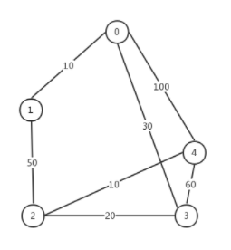

# Shortest Path

**最短路径定义**，在一个图G中，点u到点v有若干种走法，那么定义u到v的最短路径为路径权值和最小的走法。

有以下几种情况：

图：

1. 有向图
2. 无向图

边：

1. 图中无负边
2. 图中有负边，无负环
3. 图中有负边，有负环

## Floyd

## Floyd

## Floyd

## Floyd

## Floyd
 
### test

#### testtest